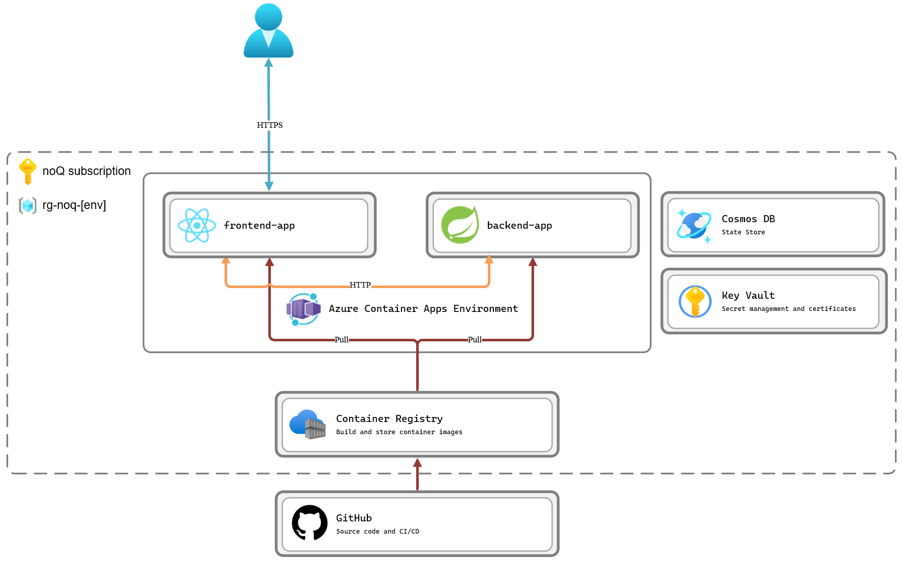

# noQ infrastructure

Cloud resources used by noQ are defined in this directory using [Bicep](https://github.com/Azure/bicep). Bicep is a Domain Specific Language (DSL) for deploying Azure resources declaratively. When deployment pipeline runs Bicep files compiles down to ARM templates. Resource deployment is done in an idempotent way, meaning that resources are only deployed if they don't already exist. This is done by comparing the current state of the resource graph with the desired state defined in the Bicep files. If there are any differences between the two, the deployment pipeline will update the resources to match the desired state. If there are no differences, the deployment pipeline will skip the deployment step. This is done to avoid unnecessary deployments and to reduce the risk of downtime.

## Recommended tooling

For a smooth developer experience the following tooling is recommended:

- [Visual Studio Code](https://code.visualstudio.com/)
- [Azure Bicep extension](https://marketplace.visualstudio.com/items?itemName=ms-azuretools.vscode-bicep)
- [Azure Resource Manager Tools extension](https://marketplace.visualstudio.com/items?itemName=msazurermtools.azurerm-vscode-tools)
- [GitHub Actions Extension](https://marketplace.visualstudio.com/items?itemName=GitHub.vscode-github-actions)
- [Azure CLI](https://docs.microsoft.com/en-us/cli/azure/install-azure-cli)

## Resource graph

The below image shows the current state of the resource graph for the noQ infrastructure. All resources are deployed in Azure and region Sweden Central.

### Annotation's

- `GitHub` - Source code management for the noQ project and GitHub Actions for CI/CD.
- `Azure Subscription` - Azure subscription for hosting the noQ infrastructure.
- `Azure Resource Group` - Resource group that represents one environment, development, test or production.
- `Azure Container Registry` - Container registry for storing Docker images, built and pushed using GitHub Actions.
- `Azure Container Apps Environment` - Managed Kubernetes environment for hosting the noQ API (backend) and web app (frontend) containers.
- `Azure Cosmos DB` - NoSQL database for storing data
- `Azure Key Vault` - Key vault for storing secrets and certificates
- `Frontend app` - React Vite app using Typescript
- `Backend app` - Java Spring Boot app

## Networking

- Traffic ingest to frontend app is handled by envoy proxy running in container apps environment.
- Traffic between frontend and backend app is only possible within Container Apps Environment.

## Continuous Integration

When you create a new Pull Request (PR) to the `main` branch, a GitHub Action ([workflow](../.github/workflows/noq-pr-validation.yml)) will run. The workflow will perform the following steps:

- `Validate front-end build` - Validate that the build of the front end application is successful.
- `Validate back-end build` - Validate that the build of the back end application is successful.
- `Dependency review` - Validate that the PR does not introduce any new unwanted dependencies with known vulnerabilities.

We require these three steps to pass before a PR can be merged into the `main` branch. This is done to ensure that the `main` branch is always in a deployable state.

## Continuous Delivery

Infrastructure resources are deployed using GitHub Actions. The following steps are performed ([workflow file](../.github/workflows/noq_deployment.yml)):

- `Verify build of frontend app` - Verify that the build of the front end application is successful.
- `Verify build of backend app` - Verify that the build of the back end application is successful.
- `Log into Azure` - Log into Azure using service principal credentials, stored as GitHub secrets.
- `Provision base infrastructure` - Deploy base infrastructure resources, such as resource group, container registry and container apps environment.
- `Sign in to Container Registry` - Log into container registry using service principal credentials, stored as GitHub secrets.
- `Build and push Docker image for frontend app` - Build and push Docker images to container registry. A new images is built and pushed for each commit to the `main` branch. The git sha for the latest commit is used as tag for the image.
- `Build and push Docker image for backend app` - Build and push Docker images to container registry. Same logic as for the frontend app is used.
- `Get container registry credentials` - Get credentials for container registry from Key Vault
- `Provision frontend container app` - Deploy frontend app container to container apps environment.
- `Provision backend container app` - Deploy backend app container to container apps environment.

User: https://ca-noq-user-client.thankfulglacier-35d24b26.swedencentral.azurecontainerapps.io

Host: https://ca-noq-host-client.thankfulglacier-35d24b26.swedencentral.azurecontainerapps.io

Admin: https://ca-noq-admin-client.thankfulglacier-35d24b26.swedencentral.azurecontainerapps.io

Backend: https://ca-noq-backend.thankfulglacier-35d24b26.swedencentral.azurecontainerapps.io
