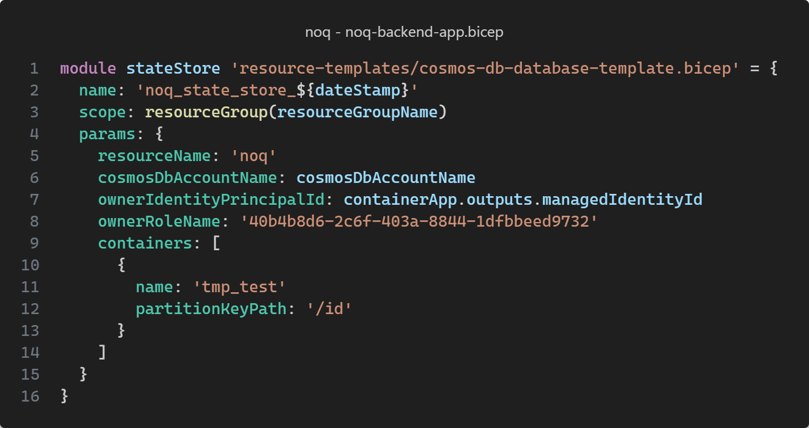

# noQ backend

## Data store

noQ utilizes Azure Cosmos DB as data store. Cosmos DB is a NoSQL database service that supports multiple data models,
such as document, key-value, graph, and columnar. Cosmos DB is a fully managed service. This means that Microsoft
handles all the infrastructure management for you, such as provisioning, patching, backups, and monitoring. Cosmos DB is
a multi-model database service, which means that you can use different data models within the same database account. In
noQ we use the document data model. A more detailed introduction to Azure Cosmos DB can be
found [here](https://docs.microsoft.com/en-us/azure/cosmos-db/introduction).

## Quick setup

Local setup found in `application-secret.properties`

```
azure.serviceURI=
azure.primarySecretKey=
azure.serviceURI=
azure.primarySecretKey=
azure.database=
azure.queryMetricsEnabled=false
azure.responseDiagnosticsEnabled=false
```

### Provision new containers

If a new container need to be provisioned, follow the steps below:
Edit the [noq-backend-app-bicep](../infrastructure/noq-backend-app.bicep) file and add a new object to the containers
array. The object have to contain properties "name" and "partitionKeyPath". See example below on line 10 to 13. Here a
new container with name `tmp_test` is provisioned and the property `id` is used as partition key.



Please review this information on
how [partitioning](https://learn.microsoft.com/en-us/azure/cosmos-db/partitioning-overview) works in Azure Cosmos DB
before adding new containers. The partition key cannot be changed after container creation and is a key factor when it
comes to query performance.

### Authentication

When connection to Cosmos DB account you should use the managed identity of the container app the backend application is
running in. This container app has already been granted the needed roles to read or write data to the containers. Below
is an example of how to connect to Cosmos DB using the managed identity of the container app using the JAVA SDK.

```java
CosmosAsyncClient Client=new CosmosClientBuilder().endpoint("<account-endpoint>").credential(new ManagedIdentityCredential()).build();
```

The account endpoint can be read from environment variable `COSMOS_DB_ACCOUNT_NAME`.

### Development tools

#### Data Explorer

In terms of browsing data in a Cosmos DB account, there are several options. The easiest one to use is the online data
explorer provided by Microsoft. You can use it by going to the [https://cosmos.azure.com](https://cosmos.azure.com/) in
your browser. When you reach the login page click `Connect to your account using connection string` and paste the
relevant connection string for the noQ environment you want to browse.

#### Cosmos DB emulator

When doing local development it is possible to emulate the Cosmos DB service on your PC or Mac. This is recommended as
it will eliminate collisions if multiple people are working on changes in the backend simultaneously.

More detailed information on how to set up the emulator can be
found [here](https://docs.microsoft.com/en-us/azure/cosmos-db/local-emulator?tabs=ssl-netstd21).

#### Development SDK's

Microsoft provides a JAVA SDK for working with Cosmos DB collections. This SDK is used in the noQ backend. More
information on the SDK and where to download from Maven can be
found [here](https://docs.microsoft.com/en-us/azure/cosmos-db/sql-api-sdk-java-v4).
